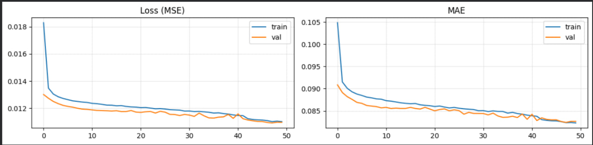
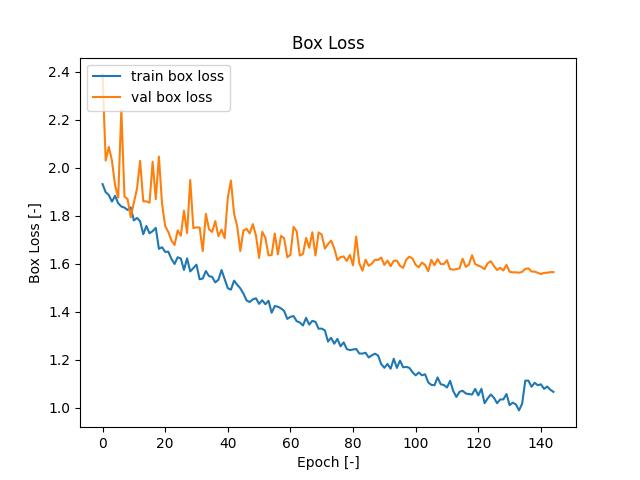
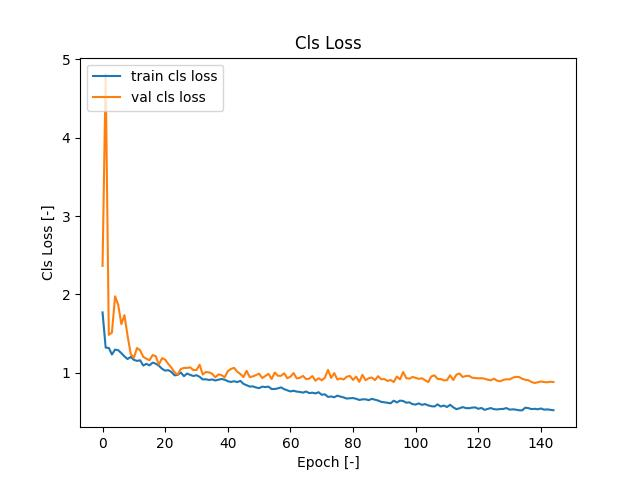
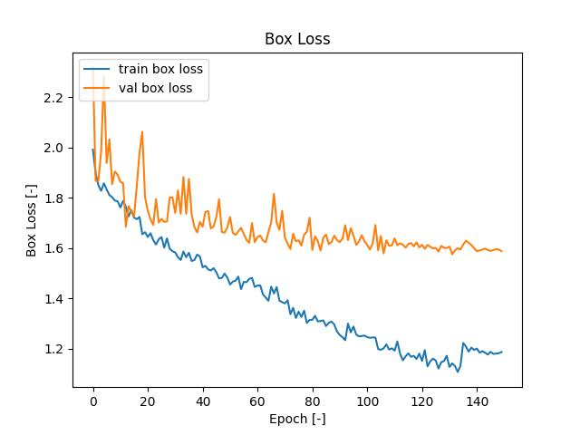
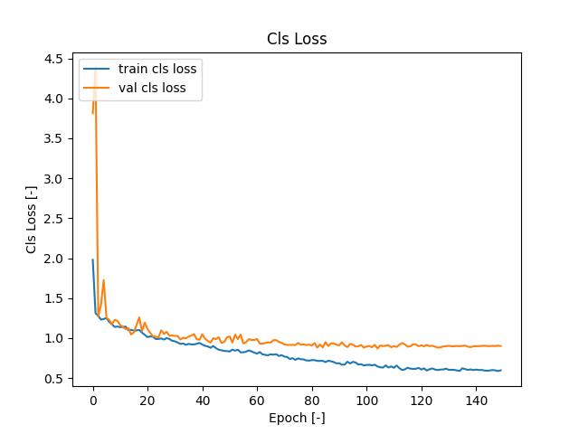
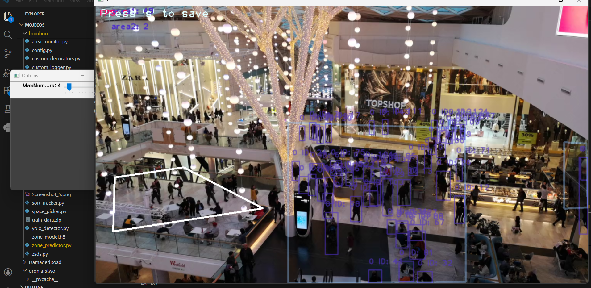

# Real-Time People Counting & Occupancy Prediction System

## Short description
System for monitoring the number of people in specific areas and forecasting the number of people who will be there in the future – in 30 and 60 seconds.

It's made of 6 components:
 - **area_monitor**
 - **sort_tracker**
 - **space_picker**
 - **webapp**
 - **yolo_detector**
 - **zone_predictor**

[](https://www.youtube.com/watch?v=j9U-OVMo_V0k)

## Setup
  - ```pip install -r requirements.txt```

## Packages
```
filterpy==1.4.5
Flask==3.1.0
matplotlib==3.7.1
numpy==1.26.0
opencv_contrib_python==4.10.0.84
opencv_python==4.9.0.80
opencv_python_headless==4.9.0.80
pandas==2.0.2
Pillow==10.3.0
python-dotenv==1.0.1
sahi==0.11.22
tensorflow==2.17.0
tensorflow_intel==2.17.0
tqdm==4.65.0
ultralytics==8.3.89
```

## Occupancy Prediction Model Architecture
Model used for predicting area occupancy.

```python
def build_model(seq_len):
    seq_in  = keras.Input(shape=(seq_len, 2), name='sequence')
    meta_in = keras.Input(shape=(3,),         name='metadata')

    x = keras.layers.LSTM(64, return_sequences=True)(seq_in)
    x = keras.layers.Dropout(0.2)(x)
    x = keras.layers.LSTM(32)(x)

    m = keras.layers.Dense(16, activation='relu')(meta_in)

    z = keras.layers.Concatenate()([x, m])
    z = keras.layers.Dense(64, activation='relu')(z)
    z = keras.layers.Dense(32, activation='relu')(z)
    out = keras.layers.Dense(1, activation='sigmoid')(z)

    model = keras.Model(inputs={'sequence': seq_in, 'metadata': meta_in}, outputs=out)
    model.compile(optimizer='adam', loss='mse', metrics=['mae'])
```

### 1. Input Layers:
The model accepts two separate inputs: a **sequence input** of shape `(seq_len, 2)` representing time-series data with 2 features per timestep, and a **metadata input** of shape `(3,)` containing 3 scalar features.

### 2. Recurrent Branch (LSTM):
The sequence input is processed by two stacked LSTM layers. The first LSTM layer contains 64 units and returns the full sequence of hidden states (`return_sequences=True`), allowing the subsequent layer to operate on the entire temporal context. A Dropout layer (rate 0.2) follows for regularization. The second LSTM layer contains 32 units and outputs only the final hidden state, producing a fixed-size vector summarizing the entire sequence.

### 3. Metadata Branch (Dense):
The metadata input is independently processed by a single Dense layer with 16 units and ReLU activation, projecting the raw scalar features into a learned representation.

### 4. Fusion (Concatenation):
The output vectors from both branches — the LSTM summary vector (32-dim) and the metadata embedding (16-dim) — are concatenated into a single combined representation (48-dim), allowing the model to reason jointly over temporal patterns and contextual metadata.

### 5. Dense Layers and Output:
Two fully connected Dense layers with 64 and 32 units (both ReLU) further refine the fused representation. The final output layer contains a single unit with **sigmoid activation**, producing a probability score in the range [0, 1] suitable for binary classification or bounded regression.

### 6. Compilation:
The model is compiled with the **Adam** optimizer and **Mean Squared Error (MSE)** loss, with Mean Absolute Error (MAE) tracked as an additional metric.

### 6. Training:
Model was trained on artificially generated data inspired by real data that has been gathered from pexels videos.

```python
def generate_from_real(n_hours=10, seed=0):
    """
    Generates synthetic people count data that mimics real YOLO detections.
    Based on statistical analysis of 6 real recording sessions:
      - sampling interval: ~2.54s (YOLOv11 processing time + 1s)
      - steps distribution: 75% no change, 12% +1, 9% -1, rare ±2/3
      - count range: 0–36, mean ~7, right-skewed distribution
    """
    rng = np.random.RandomState(seed)
    interval = 2.54                              # seconds per sample (matches real YOLO fps)
    steps = int(n_hours * 3600 / interval)       # total number of samples

    # step probabilities derived from real data diff analysis
    # slightly more -1 than +1 to prevent drift toward max capacity
    step_values = [-3, -2, -1,  0,  1,  2,  3]
    step_probs  = np.array([0.004, 0.010, 0.130, 0.720, 0.110, 0.020, 0.004])
    step_probs  /= step_probs.sum()              # normalize to sum = 1.0

    counts = np.zeros(steps)
    counts[0] = rng.randint(1, 10)              # start with low count (zone not yet active)

    # session = period with stable target occupancy level (simulates different scenes/times of day)
    session_len    = int(rng.uniform(200, 600))
    # exponential distribution: most sessions have low occupancy, rare busy periods
    # scale=3.0 gives mean ~3, matching real data mean of 7.1/36 ≈ 0.197 normalized
    session_target = np.clip(rng.exponential(scale=3.0), 0, 30)

    for i in range(1, steps):
        # periodically shift to a new occupancy level (new scene, rush hour, etc.)
        if i % session_len == 0:
            session_len    = int(rng.uniform(200, 600))
            session_target = np.clip(rng.exponential(scale=3.0), 0, 30)

        c    = counts[i-1]
        # mean reversion: gently pull count toward session target
        # strength 0.02 = slow drift, prevents random walk from diverging
        pull = (session_target - c) * 0.02
        step = rng.choice(step_values, p=step_probs) + pull
        counts[i] = np.clip(round(c + step), 0, 36)

    return pd.DataFrame({'timestamp': np.arange(steps) * interval,
                         'count': counts.astype(int)})


# ── Validation ──────────────────────────────────────────────────────────────
df = generate_from_real(n_hours=10)
diffs = np.diff(df['count'].values)
unique, freq = np.unique(diffs, return_counts=True)
total = len(diffs)

# summary stats — verify count range matches real data (0–36, mean ~7, std ~8)
print(f'count: min={df["count"].min()} max={df["count"].max()} mean={df["count"].mean():.1f} std={df["count"].std():.2f}')

# step distribution — compare synthetic vs real (shown in parentheses)
# goal: synthetic percentages should be close to real values
# if +1 >> -1 the generator will drift upward and saturate at max capacity
print('step distribution:')
for u, f_ in zip(unique, freq):
    if abs(f_/total) > 0.001:
        print(f'  {u:+d}: {f_/total*100:.1f}%  (real: {dict(zip([-3,-2,-1,0,1,2,3,4],[0.4,0.6,8.7,75.4,11.9,2.5,0.2,0.1])).get(u, "??")}%)')

# plot first 5000 samples (~3.5 hours) to visually check:
#   - no flat lines saturating at 0 or 36
#   - visible session shifts (step changes in baseline)
#   - realistic noise (not too smooth, not too chaotic)
plt.figure(figsize=(13, 3))
plt.plot(df['timestamp'][:5000] / 60, df['count'][:5000], linewidth=0.8)
plt.title('Synthetic data modeled on real recordings')
plt.xlabel('Time [min]'); plt.ylabel('People count')
plt.grid(alpha=0.3); plt.tight_layout(); plt.show()


def build_dataset(df, cfg):
    seq_len  = cfg['seq_len']
    cap      = cfg['zone_capacity']
    counts   = df['count'].values
    times    = df['timestamp'].values
    X_seq, X_meta, Y, H = [], [], [], []

    for i in range(seq_len, len(df) - max(cfg['horizons'])):
        wt = times[i - seq_len : i]
        wc = counts[i - seq_len : i]
        duration = float(wt[-1] - wt[0])
        if duration < 1:
            continue

        seq = np.stack([
            (wt - wt[0]) / duration,   # czas relatywny [0..1]
            wc / cap                    # count znormalizowany
        ], axis=1).astype(np.float32)

        for horizon in cfg['horizons']:
            steps_ahead = int(horizon / 2.5)
            ti = i + horizon
            if ti >= len(counts):
                continue

            """
            Three numbers normalised to the same range `[0, 1]`:

            duration_s / 600   →  ‘I observed for X% of 10 minutes’
            horizon_s  / 600   →  ‘I want a prediction for X% of the next 10 minutes’
            capacity   / 200   →  ‘the zone accommodates X% of 200 people’
            """
            meta = np.array([duration / 600, horizon / 600, cap / 200], dtype=np.float32)
            X_seq.append(seq)
            X_meta.append(meta)
            Y.append(counts[ti] / cap)
            H.append(horizon)

    return np.array(X_seq), np.array(X_meta), np.array(Y, dtype=np.float32), np.array(H)


X_seq, X_meta, Y, H = build_dataset(df, CONFIG)

idx = np.arange(len(Y))
idx_tr, idx_te = train_test_split(idx, test_size=0.2, random_state=42)

print(f'Train: {len(idx_tr):,}  |  Test: {len(idx_te):,}')
print(f'X_seq shape: {X_seq.shape}')
```


Both train loss and MAE (Mean Absolute Error) and validation loss and MAE quickly dropped and almost aligned with each other.
`EarlyStopping` callback restored weight from 48th epoch as the best.

## Yolov11 Model
Yolov11 has been trained on my custom dataset, assembled from pexel videos and Google images. There is only one class `person` in classes.txt

### Medium version training results

**mAP50-95(B)** - mean Average Precision averaged across IoU thresholds from 50% to 95%.
.jpg)

**mAP50(B)** - percentage of correct detections at IoU ≥ 50%.
.jpg)

`IoU is a metric that measures the degree of overlap between two rectangles (bounding boxes) - used for eliminating duplicated boxes. The more agressive value, the more accurate box has to be.`

**Box loss** - bounding box localization error (position and size). The lower the value, 
the more accurate the bounding boxes are.




**Cls loss** - classification error.



**Precision and recall** -  how many of the detected objects are actual objects? (high = few false positives). Recall – how many of the actual objects did the model detect? (high = few false negatives).

.jpg)

### Small version training results

**mAP50-95(B)** - mean Average Precision averaged across IoU thresholds from 50% to 95%.
.jpg)

**mAP50(B)** - percentage of correct detections at IoU ≥ 50%.
.jpg)

`IoU is a metric that measures the degree of overlap between two rectangles (bounding boxes) - used for eliminating duplicated boxes. The more agressive value, the more accurate box has to be.`

**Box loss** - bounding box localization error (position and size). The lower the value, 
the more accurate the bounding boxes are.




**Cls loss** - classification error.



**Precision and recall** -  how many of the detected objects are actual objects? (high = few false positives). Recall – how many of the actual objects did the model detect? (high = few false negatives).

.jpg)


## Area monitor
The most important file is `area_monitor.py` which contains main functionality - YOLO detections, counting and area occupancy prediction.

| Attribute | Type | Default | Description |
|-----------|------|---------|-------------|
| `yolo_model_path` | `Union[str, Path]` | - | Path to the YOLOv11 model weights file (required) |
| `classes_path` | `Union[str, Path]` | - | Path to model classes (required) |
| `device` | `str` |  `"cpu"` | Device ("cpu", "cuda:0") |
| `sort_max_age` | `int` |  - | max age of tracked object - for example if set to 5 object will be lost if not seen for 5 frames |
| `sort_min_hits` | `int` |  - | how many times object has to be seen in order to be tracked |
| `sort_iou_threshold` | `float` |  - | Intersection Over Union (IoU) threshold - it's used to "recognize" if it's the same object, for example if set to 0.3 boxes have to align in 30% in order to tell if it's the same object. |
| `zone_model_path` | `Union[str, Path]` |  - | path to occupancy prediction model |
| `_seq_len` | `int` |  - | max len of sequence used for occupancy prediction |

### Main methods

**yolo_detect** - method for getting raw YOLO detections.

**process_images** - method for processing frames with normalized YOLO detections, drawing results and counting people in areas.

**process_video** - method for processing video inputs, uses `process_images` but also does occupancy predictions.

**stream_video** - the same as `process_video` but for web app.

**load_areas** - method for loading areas configuration.

## Space picker
File `space_picker.py` is used to generate json files with areas definitions for video inputs. It's important to keep proper naming, for example if you want to use video, rename video file to `example1.mp4` and area json file should be called `example1.json`. For webcams just name area json as `cam_[webcam_id].json`. It is important for web app, becuase on init it creates mapping `input: area config`, in regular `area_monitor.py` you provide paths directly using `load_areas` method.



```python
picker = SpacePicker(areas_res_path=f"{Config.AREAS_FOLDER}/video3.json")
picker.run(
    image_path=r"Screenshot_5.png")
```

## Web app
web app xd

to run use
```shell
python .\webapp\run.py 
```

